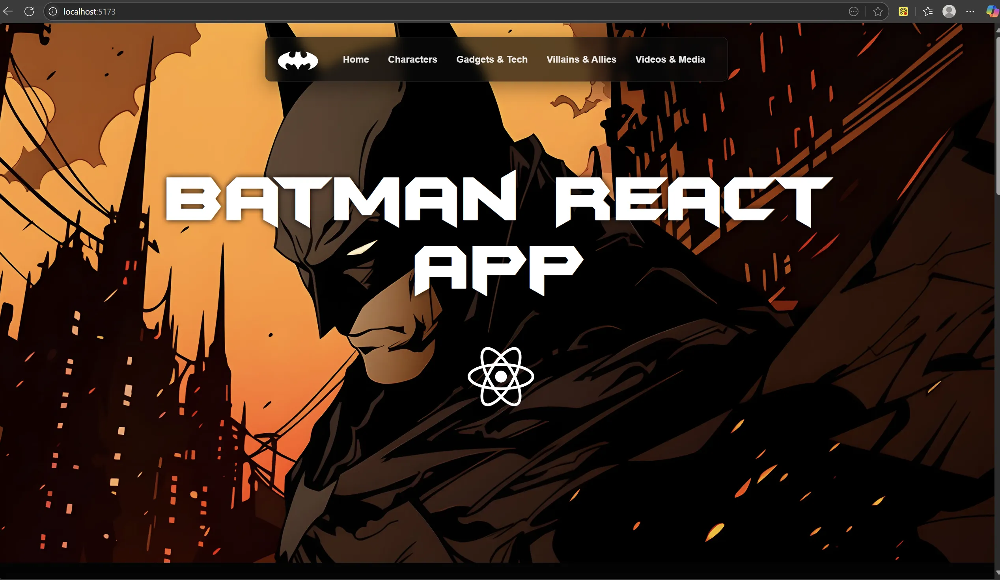
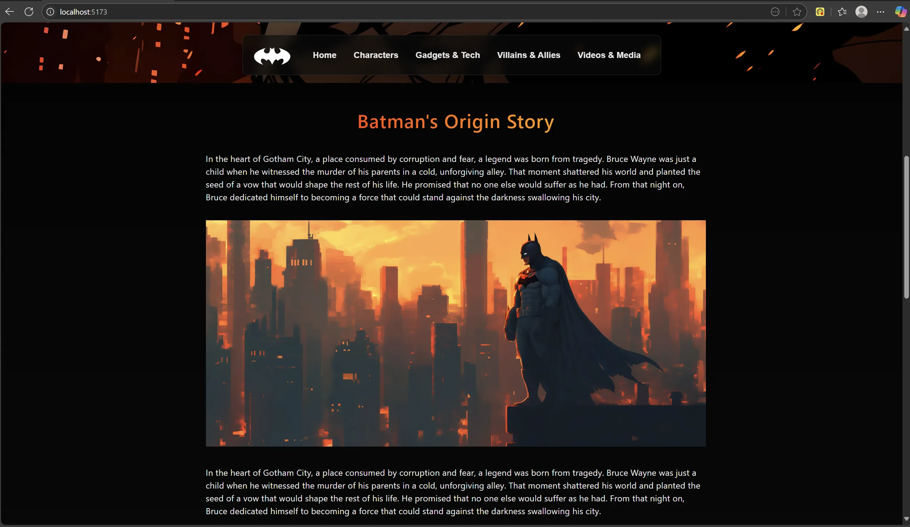
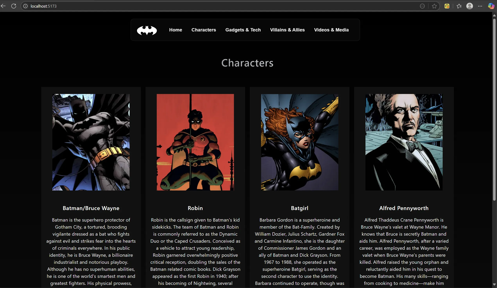
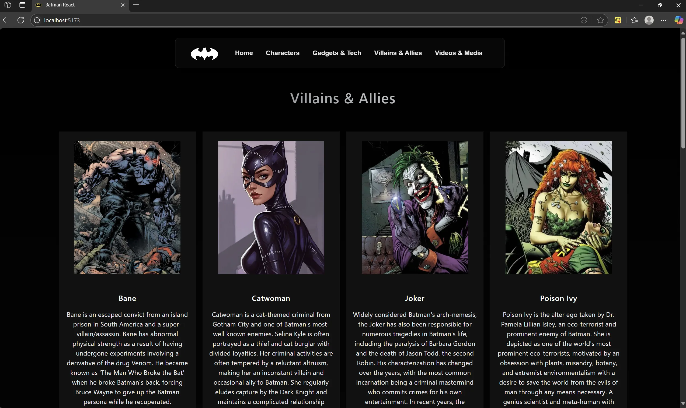
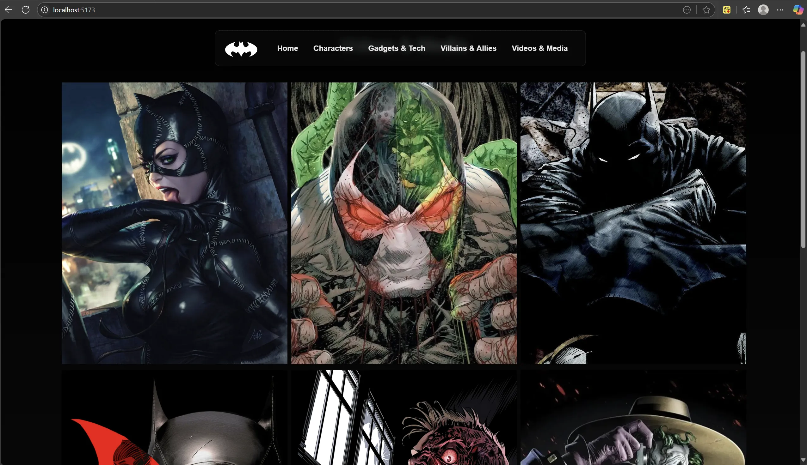
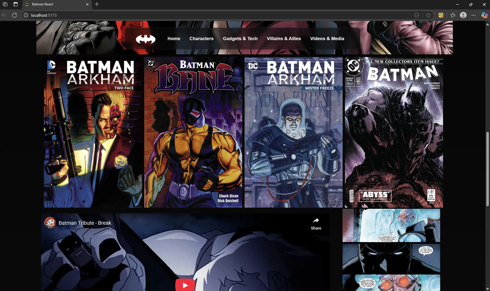
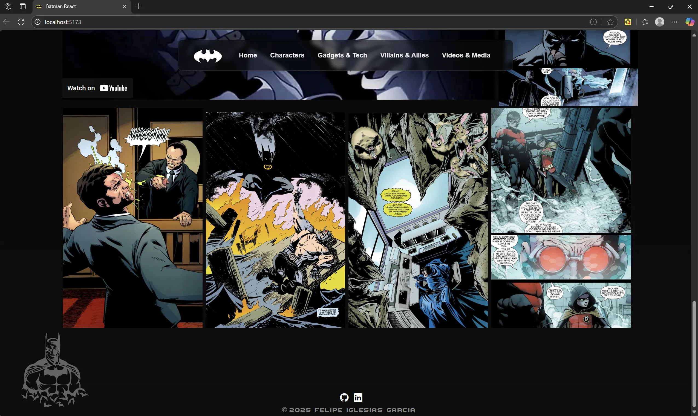

## 📄 Description

🌕🦇This is a React app project built with Vite, based on the Batman universe. The app is made up of components that are displayed using control functions.
The content of the different sections is displayed using a function that reads data from a JSON file. Therefore, to update the content, the user only needs to change the information in the JSON file.

* 🚫🤖 No AI code 
* 📁 Local content

The website is optimized for a 16" 2560x1600 display with a 16:10 aspect ratio.

♦️ To run the app using the **React + Vite** environment (assuming you have **Node.js** and **npm** installed), follow these steps in your terminal:

* npm create vite@latest testBatmanApp -- --template react
* cd testBatmanApp
* npm install
* npm run dev

Finally, replace the $${\color{orange}Orange}$$ directory with the one from this repository.
    

## 📷 Screenshots

  

